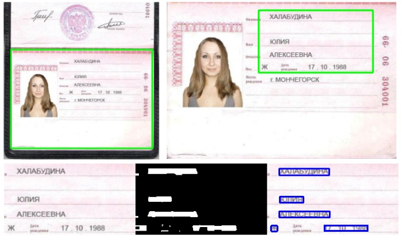
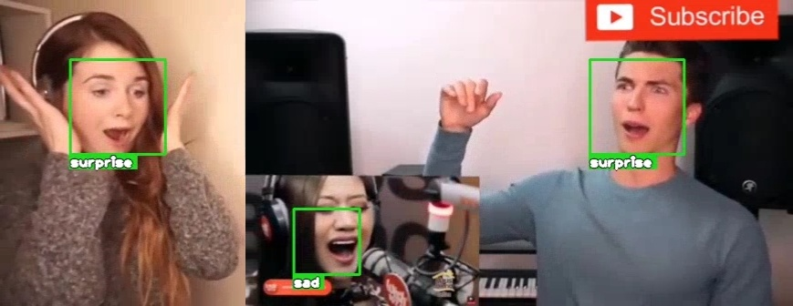
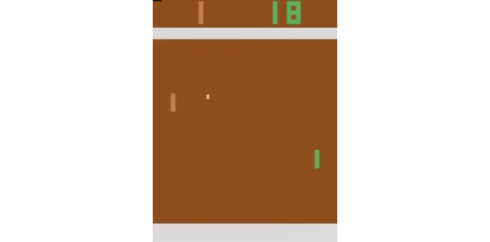

Language: en | [ru](README-RU.md)

# Portfolio

*Computer vision / AI*

1. [Passport scan recognition using neural networks](#passport-ocr)
1. [AI system for tracking user emotions with web-camera](#webcam-emotion-recognition)
1. [AI capable of learning to play Ping-Pong game](#pong-ai)

## Passport scan recognition using neural networks

*2022-12*

* [github.com/d-01/passport-ocr-test](https://github.com/d-01/passport-ocr-test)
* Recognition is done in three steps:
  1. Passport's page localized on an input image
  1. Textual fields detected in the target area
  1. Individual characters are recognized with three different methods (OCR, API, neural networks)
* No installation required, runs entirely in Google Colab ([open](https://colab.research.google.com/drive/1c3nP5v1tXdU9bPQe59H3ZFRu5TWkMCcU)).
* Tech-stack: python, opencv, pillow, OCR, tensorflow, keras, numpy, cnn

## AI system for tracking user emotions with web-camera

*2022-01*

* [github.com/d-01/webcam-emotion-recognition](https://github.com/d-01/webcam-emotion-recognition)
* No installation required, runs entirely in Google Colab ([open](https://colab.research.google.com/drive/1c3nP5v1tXdU9bPQe59H3ZFRu5TWkMCcU)).
* Uses web-camera (browser access required), tracks face in the frame and recognizes emotion.
* Tech-stack: python, tensorflow, keras, opencv, cnn, mobilenet, fer, facial expression recognition, valence-arousal, face detection, dlib, google colab, javascript, html canvas

## AI capable of learning to play Ping-Pong game

*2021-09*

* [Open](https://d-01.github.io/static/jupyter-export/pong-ai.html) Jupyter Notebook
* [Video](img/pong-q-learning-demo.mp4)
* Training neural network to play Atari Pong game using raw-pixel data as input.
* Tech-stack: RL, reinforcement learning, tensorflow, gym, Q-learning, CNN, DQN, replay buffer

